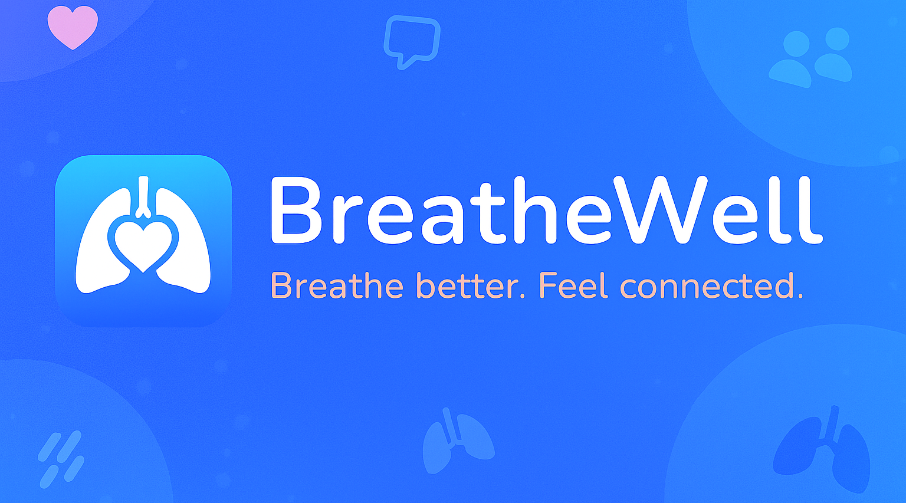

# 🫁 BreatheWell

**Breathe better. Feel connected.**  
A mobile app designed to support people living with COPD through symptom tracking, helpful resources, community forums, and an AI companion.

---

## 🌱 About the Project

**BreatheWell** is my final-year dissertation project focused on reducing isolation and loneliness among COPD patients. It combines accessible design, emotional support, and community-driven features to create a safe and inclusive space.

This project is inspired by my late **Nan** and **Uncle**, whose experiences with COPD shaped my belief in compassionate, inclusive technology. BreatheWell is built to honour their memory - and to help others in a similar position feel less alone.

---

## 🛠️ Tech Stack

- tbc

---

## 🧪 Research Themes

- Human-computer interaction in chronic illness
- Digital inclusion and accessibility
- Community dynamics in health support apps
- Ethical AI companionship and data privacy

---

## 📎 Links

- 🔗 [Design Mockups](#)
- 📚 [Research Notes](#)
- 🧠 [AI Companion Concept](#)
- 🗂️ [Issue Diary](https://github.com/amylouisejordan/breathewell-dissertation/issues?q=label%3Aprogress-log)
